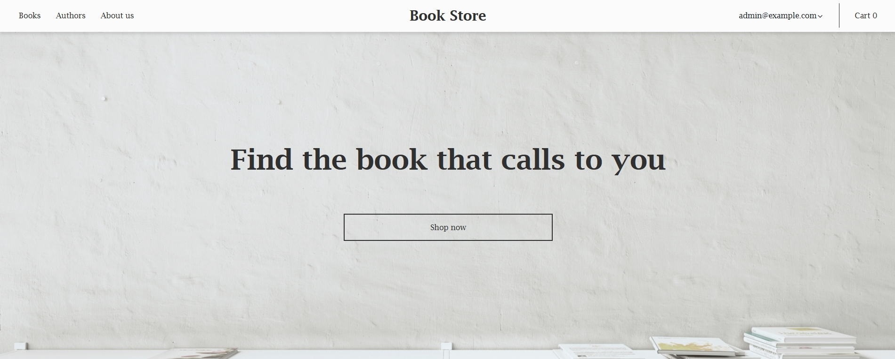
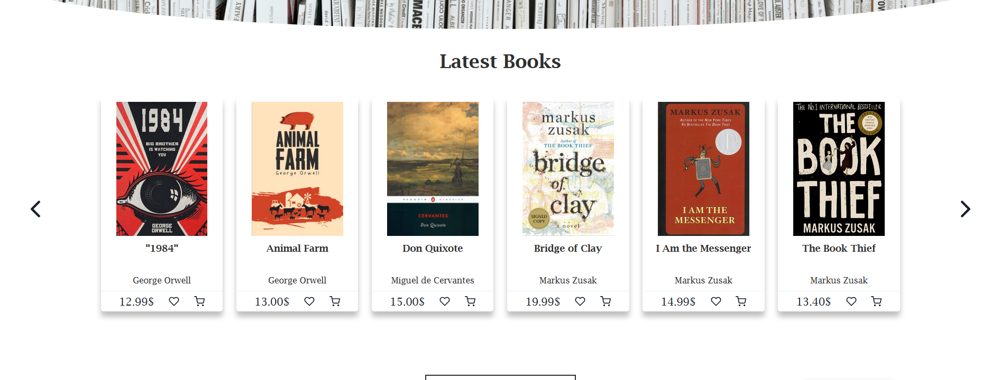
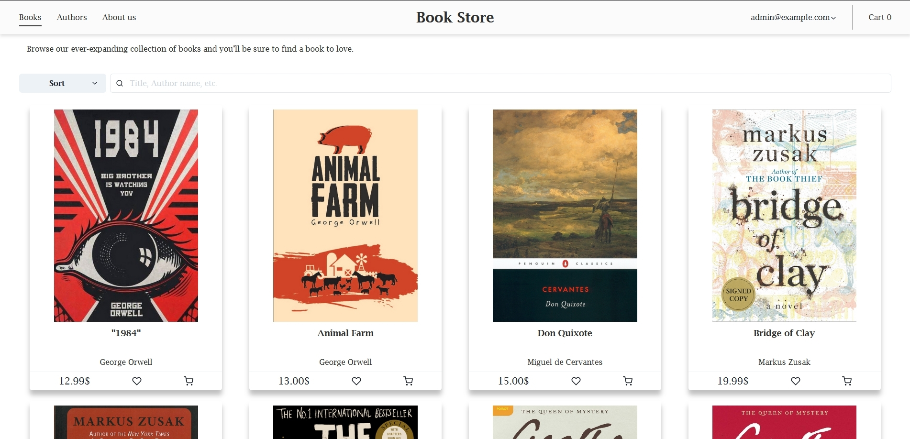
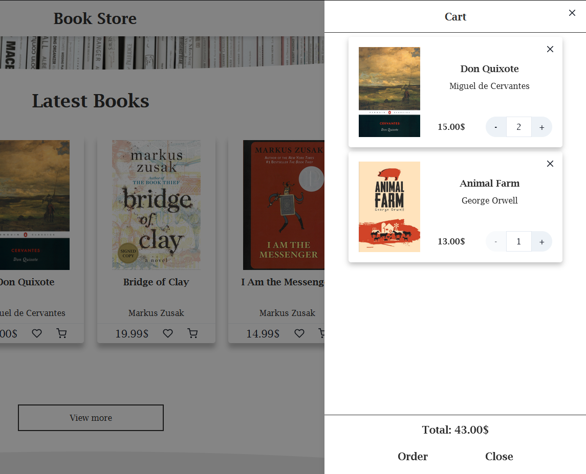
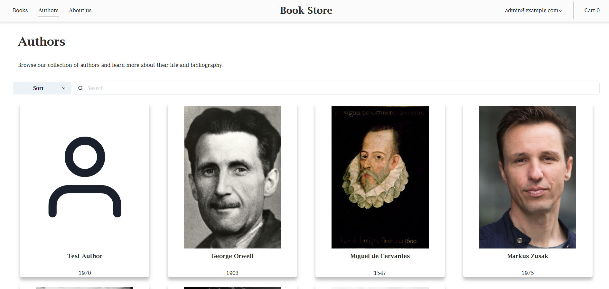
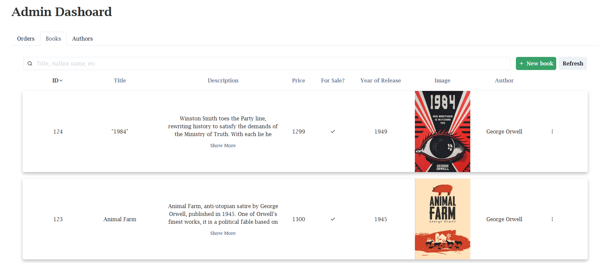
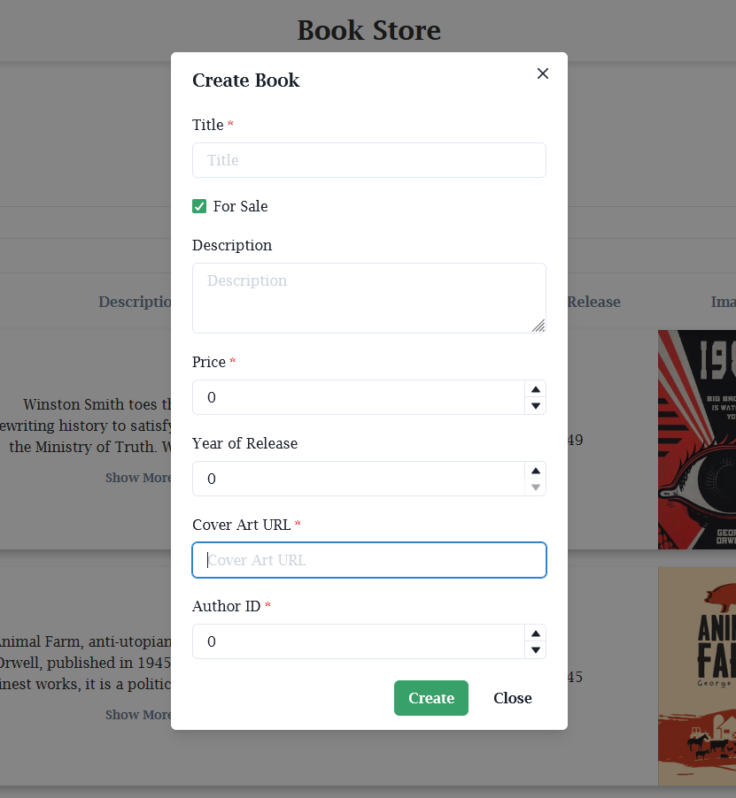

# Book store Web App created with React and Spring

An ongoing project for a web application, designed for selling and managing books. It utilizes various technologies such as

- [React](https://reactjs.org/)
- [Next.js](https://nextjs.org/)
- [Chakra UI](https://chakra-ui.com/)
- [Redux](https://redux.js.org/)
- [Spring Framework](https://spring.io/)
- [PostgreSQL](https://www.postgresql.org/)
- [Auth0](https://auth0.com/)

## Functionality

The web application enforces a `Role-based access control` with the help of `Auth0`, which limits the capabilities of `regular users` and gives full freedom to `admins`.

- Books/Authors
  - Full CRUD functionality for admin users
  - Read functionality for regular users
- Cart
  - A shopping cart, implemented with `Redux` so that it can be accessed from anywhere on the application
  - Persists through refresh by utilizing the browser's `local storage`
- Admin Dashboard
  - A `CMS` interface, allowing admins to modify book/author data without having to manually interact with the database

## To do

Some functionality I am planning to implement when I find the time include:

- Add the ability for users to place orders (both with online payments and pay-on-delivery)
- Add support for file uploads for the cover images of books and images of authors (through an external cloud provider)

## Showcase

